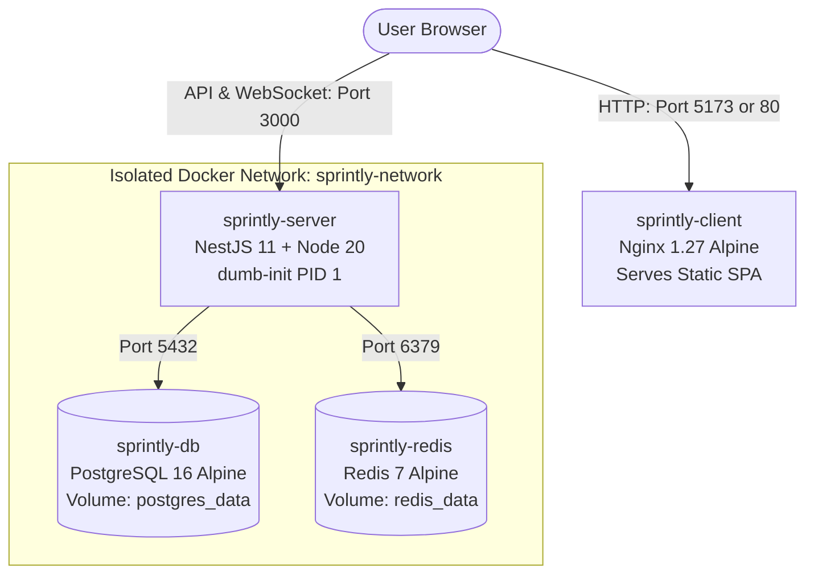

# 🐳 Sprintly DevOps & Docker Engineering Guide

Welcome to the Sprintly Docker & DevOps engineering guide. This document explains the architecture, security practices, performance optimizations, and design decisions implemented in Sprintly's container setup, alongside practical operational commands.

---

## 📑 Table of Contents
1. [Architecture Overview](#-architecture-overview)
2. [Key DevOps Concepts & Design Decisions](#-key-devops-concepts--design-decisions)
   - [Multi-Stage Builds: Why & How](#1-multi-stage-builds-why--how)
   - [Docker Layer Caching Mechanics](#2-docker-layer-caching-mechanics)
   - [The PID 1 Problem & dumb-init](#3-the-pid-1-problem--dumb-init)
   - [Container Security & Non-Root Execution](#4-container-security--non-root-execution)
   - [Client SPA Routing & Nginx Web Server](#5-client-spa-routing--nginx-web-server)
   - [Database Migrations & Lifecycle Automation](#6-database-migrations--lifecycle-automation)
3. [File Breakdown & Line-by-Line Guide](#-file-breakdown--line-by-line-guide)
   - [server/Dockerfile](#serverdockerfile)
   - [client/Dockerfile](#clientdockerfile)
   - [client/nginx.conf](#clientnginxconf)
   - [docker-compose.yml](#docker-composeyml)
4. [Operations Cheat Sheet](#-operations-cheat-sheet)
5. [Troubleshooting & FAQs](#-troubleshooting--faqs)

---

## 🏛 Architecture Overview

Sprintly's container stack runs four coordinated services connected over an isolated bridge network (`sprintly-network`):



| Service | Base Image | Role | Port (Host:Container) | Health Check Probe |
|---|---|---|---|---|
| **`db`** | `postgres:16-alpine` | PostgreSQL relational database | `5432:5432` | `pg_isready -U postgres -d sprintly` |
| **`redis`** | `redis:7-alpine` | Socket.IO scaling & memory cache | `6379:6379` | `redis-cli ping` |
| **`server`** | `node:20-bookworm-slim` | NestJS REST API & WebSockets | `3000:3000` | `wget http://localhost:3000/api/health` |
| **`client`** | `nginx:1.27-alpine` | React 19 SPA static web server | `5173:80` | `wget http://localhost:80/healthz` |

---

## 💡 Key DevOps Concepts & Design Decisions

### 1. Multi-Stage Builds: Why & How
A standard single-stage Dockerfile copies source code, installs development dependencies (TypeScript compiler, linters, test libraries), builds the app, and leaves all those tools inside the final image. This results in:
- Bloated images (~1.2 GB+).
- Larger attack surface (compilers, shell tools, and dev packages inside production).

**Multi-Stage Build Solution**:
- **Builder Stage (`AS builder`)**: Contains full build tools (`pnpm`, TypeScript, Nest CLI, devDependencies). It compiles TypeScript to JavaScript (`dist/`) and generates the Prisma client.
- **Runner Stage (`AS runner`)**: Starts from a completely fresh, minimal base image. We copy **only** the compiled JavaScript (`dist/`) and production `node_modules` from the builder stage. The compiler, source files, and dev tools are discarded.
- **Result**: Final backend image drops to ~200MB; frontend image drops to ~25MB!

---

### 2. Docker Layer Caching Mechanics
Docker caches each command layer sequentially. If a layer's input files have not changed, Docker skips re-executing that layer and reuses the cache.

**Anti-pattern**:
```dockerfile
# BAD: Any small source code edit invalidates the package install cache!
COPY . .
RUN pnpm install
RUN pnpm build
```

**Senior DevOps Best Practice**:
```dockerfile
# GOOD: Copy lockfile and package manifest FIRST
COPY pnpm-lock.yaml package.json ./
RUN pnpm install --frozen-lockfile

# Source code is copied AFTER dependencies are cached
COPY src ./src
RUN pnpm build
```
When you change a TypeScript file, Docker reuses the cached `pnpm install` step in **0.1 seconds** instead of reinstalling 800+ npm packages!

---

### 3. The PID 1 Problem & dumb-init
When a process runs inside a container as PID 1 (Process ID 1), the Linux kernel treats it specially:
1. **Signal Handling**: Regular processes inherit default signal handlers (like exiting on `SIGTERM`). But PID 1 does **not** get default handlers. If your Node.js application does not explicitly handle `SIGTERM`, running `docker stop` will hang for 10 seconds before forcefully killing the container (`SIGKILL`).
2. **Zombie Process Reaping**: When child processes exit, their parent must reap them. If the parent dies, children get re-parented to PID 1. Node.js is not designed to be an init system and does not reap zombies, leading to process table exhaustion.

**Solution: `dumb-init`**:
`dumb-init` is an ultra-lightweight init system written in C. It runs as PID 1, forwards all signals (`SIGTERM`, `SIGINT`) properly to the Node process, and reaps orphaned child processes cleanly.

---

### 4. Container Security & Non-Root Execution
By default, Docker containers run as the Linux `root` superuser. If an attacker exploits a remote code execution vulnerability in a web framework, they gain root privileges inside the container, increasing the risk of container escape to the host.

In `server/Dockerfile`, we switch to the unprivileged `node` user:
```dockerfile
USER node
```
This adheres to the **Principle of Least Privilege**.

---

### 5. Client SPA Routing & Nginx Web Server
In a Single Page Application (SPA) like React Router:
- The user requests `http://localhost:5173/` -> Nginx returns `index.html`.
- The user clicks on "Projects" -> React Router changes the URL to `/projects` in the browser without reloading the page.
- **The Problem**: If the user presses **F5 (Refresh)** on `/projects`, the browser sends a GET request to `/projects`. A default web server looks for a file called `/projects` or `/projects/index.html` on disk, finds nothing, and returns **404 Not Found**!

**The Fix in `nginx.conf`**:
```nginx
location / {
    try_files $uri $uri/ /index.html;
}
```
If the exact static file exists (e.g. `logo.svg` or `bundle.js`), Nginx serves it directly. Otherwise, it falls back to `/index.html`, allowing React Router to handle the route in the browser!

---

### 6. Database Migrations & System Seeder Automation
Running database migrations and seeders manually on production servers is error-prone. In Sprintly:
- The database service (`db`) has a health check (`pg_isready`).
- The `server` container will **not start** until `db` is fully healthy (`condition: service_healthy`).
- The server's `docker-entrypoint.sh` automatically executes:
  1. `npx prisma migrate deploy` to ensure the schema is up to date.
  2. `node dist/prisma/seed.js` to prime mandatory system roles (`OWNER`, `ADMIN`, `MEMBER`, `VIEWER`) and 22 permissions.
- **Why `node dist/prisma/seed.js` instead of `prisma db seed`?**
  In development, Prisma uses `ts-node prisma/seed.ts`. In our production runner container, `ts-node` is pruned to minimize image size and attack surface. Running the pre-compiled `dist/prisma/seed.js` uses standard Node.js with zero development tools.
- **Idempotency**: Because `seedRoles` and `seedPermissions` use `upsert` and check for existing records, it safely runs on every container reboot without duplicating records or touching user data.

---

### 7. Cookie Security & Cross-Port Authentication
- Refresh tokens are stored in an `httpOnly` cookie.
- The cookie path is strictly unified to `/api/auth` so that only the `/api/auth/refresh` and auth endpoints receive it.

---

## 🛠 File Breakdown & Line-by-Line Guide

### `server/Dockerfile`
```dockerfile
# 1. Base image with glibc for Prisma & bcrypt compatibility
FROM node:20-bookworm-slim AS builder

# 2. System dependencies needed by Prisma engine during generation
RUN apt-get update -y && apt-get install -y --no-install-recommends openssl ca-certificates && rm -rf /var/lib/apt/lists/*

# 3. Pin pnpm version via Corepack for deterministic builds
RUN corepack enable && corepack prepare pnpm@10.34.5 --activate

# 4. Set container working directory
WORKDIR /app

# 5. Copy manifest files first for caching
COPY pnpm-lock.yaml pnpm-workspace.yaml* package.json ./
COPY prisma ./prisma/

# 6. Install dependencies with frozen lockfile (strict reproducibility)
RUN pnpm install --frozen-lockfile

# 7. Generate Prisma Client bindings
RUN pnpm prisma:generate

# 8. Copy code and compile to dist/
COPY tsconfig*.json nest-cli.json ./
COPY src ./src
RUN pnpm build
RUN pnpm prune --prod

# 9. Minimal runner stage
FROM node:20-bookworm-slim AS runner

# 10. Install dumb-init (PID 1), openssl (Prisma runtime), wget (healthcheck)
RUN apt-get update -y && apt-get install -y --no-install-recommends dumb-init openssl wget && rm -rf /var/lib/apt/lists/*

WORKDIR /app
ENV NODE_ENV=production PORT=3000
RUN chown -R node:node /app

# 11. Copy only production files from builder
COPY --chown=node:node --from=builder /app/node_modules ./node_modules
COPY --chown=node:node --from=builder /app/dist ./dist
COPY --chown=node:node --from=builder /app/package.json ./package.json
COPY --chown=node:node --from=builder /app/prisma ./prisma
COPY --chown=node:node docker-entrypoint.sh ./docker-entrypoint.sh
RUN chmod +x ./docker-entrypoint.sh

# 12. Drop root privileges
USER node
EXPOSE 3000

# 13. Healthcheck probe
HEALTHCHECK --interval=30s --timeout=5s --start-period=15s --retries=3 \
  CMD wget -qO- http://localhost:3000/api/health || exit 1

# 14. Entrypoint and start command
ENTRYPOINT ["/usr/bin/dumb-init", "--", "./docker-entrypoint.sh"]
CMD ["node", "dist/src/main"]
```

---

## ⚡ Operations Cheat Sheet

### 1. Starting the Entire Stack
```bash
# Build images and start all 4 containers in the background
docker compose up -d --build
```

### 2. Checking Service Status & Health
```bash
# View running status and health probe states (healthy / starting / unhealthy)
docker compose ps
```

### 3. Monitoring Real-Time Logs
```bash
# Follow logs from all services:
docker compose logs -f

# Follow logs from the backend server only:
docker compose logs -f server

# Follow logs from PostgreSQL only:
docker compose logs -f db
```

### 4. Running Database Commands Inside Container
```bash
# Open interactive Prisma Studio:
docker compose exec server npx prisma studio

# Seed the database manually:
docker compose exec server npx prisma db seed

# Open interactive PostgreSQL shell (psql):
docker compose exec db psql -U postgres -d sprintly
```

### 5. Stopping the Stack
```bash
# Stop containers gracefully (preserves database data in volumes)
docker compose down

# Stop containers AND delete persistent volumes (wipes database clean)
docker compose down -v
```

---

## ❓ Troubleshooting & FAQs

### Q1: Why use `node:20-bookworm-slim` instead of `alpine`?
**Answer**: Prisma Query Engines and native C++ addons (like `bcrypt`) are compiled against standard `glibc`. Alpine uses `musl libc`. Running Prisma and bcrypt on Alpine requires complex build-tool dependencies and can cause unexpected runtime crashes or segmentation faults. Debian Slim provides standard `glibc` with rock-solid stability and adds only ~30MB.

### Q2: Why does Vite need `VITE_API_URL` at build time?
**Answer**: Unlike backend Node.js applications that read `process.env` dynamically per HTTP request, client-side React apps execute inside the user's browser. During `vite build`, Vite statically replaces `import.meta.env.VITE_API_URL` with the literal string configured at build time.

### Q3: How do I change the client or server ports on my machine?
**Answer**: Edit your `.env` file (copied from `.env.docker.example`):
```env
CLIENT_PORT=8080
SERVER_PORT=3001
```
Then run `docker compose up -d`.
